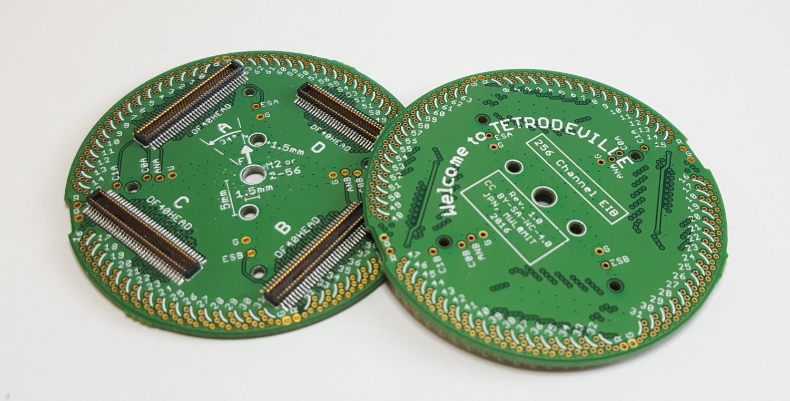

[back](../README.md)

# eib-256
256-channel electrode interface board (EIB) with electrical and optical
stimulation. Designed for large rodent tetrode electrophysiology.

## BOM
The BOM is located on [this google
sheet](https://docs.google.com/spreadsheets/d/1F-KWcdvH_63iXjZf0cgCfDiFX6XXW3qw6rlR8DZrFpQ/edit#gid=1934583654).

## Pinout
The EIB pinout (ADC input mapping, stimulation connections, etc) is located on [this google sheet](https://docs.google.com/spreadsheets/d/11wRDYOqHN5lPb03yUdfXfK0zvaDYsVetplaNK-R90Gg/edit#gid=0)

## Tetrode Connectorization
This EIB uses Neuralynx ["small" gold pins](https://neuralynx.com/hardware/small-eib-pins) to attach tetrode wires. Usage instructions are provided in the [Neuralynx EIB pin Manual](https://neuralynx.com/documents/EIB%20Pins%20Manual.pdf).

## License
Copyright Jonathan P. Newman 2017.

This documentation describes Open Hardware and is licensed under the
CERN OHL v.1.2.

You may redistribute and modify this documentation under the terms of the CERN
OHL v.1.2. (http://ohwr.org/cernohl). This documentation is distributed WITHOUT
ANY EXPRESS OR IMPLIED WARRANTY, INCLUDING OF MERCHANTABILITY, SATISFACTORY
QUALITY AND FITNESS FOR A PARTICULAR PURPOSE. Please see the CERN OHL v.1.2 for
applicable conditions
